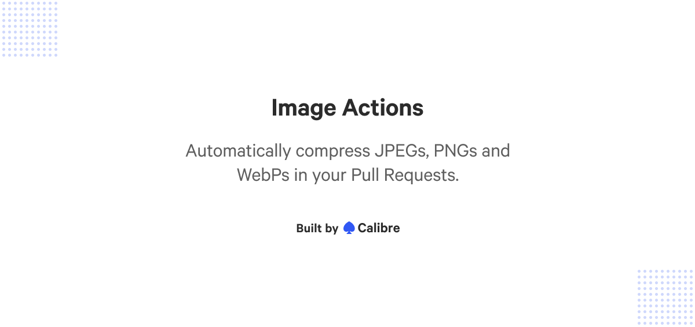
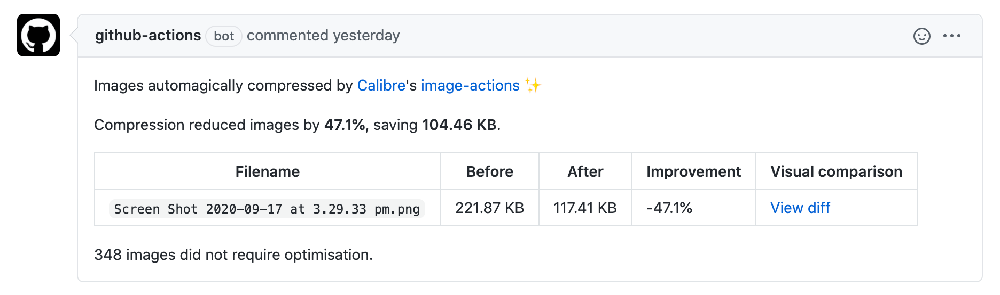

## Introduction

Image Actions is a Github Action built by performance experts at [Calibre](https://calibreapp.com/) that automatically compresses JPEGs, PNGs and WebPs in Pull Requests.

Image Actions offers:

- **Fast, efficient and near-lossless compression**
- Best image compression algorithms available ([mozjpeg](https://github.com/mozilla/mozjpeg) and [libvips](https://github.com/libvips/libvips))
- [Ease of customisation](#Configuration): use default settings or adapt to your needs
- Running on demand or schedule

...and more!

## Table of Contents

- [Usage](#usage)
- [Configuration](#configuration)
  - [Control image quality settings](#control-image-quality-settings)
  - [Ignore paths](#ignore-paths)
  - [Run compression only](#run-compression-only)
  - [Compress on demand or on schedule](#compress-on-demand-or-on-schedule)
  - [Process Pull Requests from forked repositories](#process-pull-requests-from-forked-repositories)
  - [Combined workflow](#combined-workflow)
- [Migrate legacy configuration](#migrate-legacy-configuration)
  - [Uses and `GITHUB_TOKEN` definition](#uses-and-github_token-definition)
  - [Location and name of the configuration file](#location-and-name-of-the-configuration-file)
  - [Listing `ignorePaths`](#listing--ignorepaths-)
- [Contributing](#contributing)
- [Used By](#used-by)
- [Authors](#authors)
- [Resources](#resources)
- [License](#license)

## Usage

1. Create a `.github/workflows/calibreapp-image-actions.yml` file in your repository with the following configuration:

```yml
name: Compress Images
on:
  pull_request:
    # Run Image Actions when JPG, JPEG, PNG or WebP files are added or changed.
    # See https://help.github.com/en/actions/automating-your-workflow-with-github-actions/workflow-syntax-for-github-actions#onpushpull_requestpaths for reference.
    paths:
      - '**.jpg'
      - '**.jpeg'
      - '**.png'
      - '**.webp'
jobs:
  build:
    # Only run on Pull Requests within the same repository, and not from forks.
    if: github.event.pull_request.head.repo.full_name == github.repository
    name: calibreapp/image-actions
    runs-on: ubuntu-latest
    steps:
      - name: Checkout Repo
        uses: actions/checkout@v2

      - name: Compress Images
        uses: calibreapp/image-actions@main
        with:
          # The `GITHUB_TOKEN` is automatically generated by GitHub and scoped only to the repository that is currently running the action. By default, the action can’t update Pull Requests initiated from forked repositories.
          # See https://docs.github.com/en/actions/reference/authentication-in-a-workflow and https://help.github.com/en/articles/virtual-environments-for-github-actions#token-permissions
          githubToken: ${{ secrets.GITHUB_TOKEN }}
```

2. Open a Pull Request with added or changed imagery. Image Actions will process the files and post a comment, like so:



3. Merge your Pull Request and enjoy lighter images or explore what’s possible further with [configuration options](#configuration). 👇🏻

## Configuration

By default, Image Actions will compress images so that they’re smaller and will leave your assets looking clear and crisp. If you want to change or expand those defaults, read on for available options.

:warning: If you are using an older version of Image Actions referencing `.github/calibre/image-actions.yml`, we suggest you [migrate to the latest configuration format](#migrate-legacy-configuration).

### Control image quality settings

Add the following arguments to the workflow definition to control compression settings:

```yml
with:
  jpegQuality: '80'
  jpegProgressive: false
  pngQuality: '80'
  webpQuality: '80'
```

**Options:**

- [jpegQuality](http://sharp.pixelplumbing.com/en/stable/api-output/#jpeg): Number, integer 1-100, default 80 stored in a string.
- [jpegProgressive](http://sharp.pixelplumbing.com/en/stable/api-output/#jpeg): Boolean, true or false, default false.
- [pngQuality](http://sharp.pixelplumbing.com/en/stable/api-output/#png): Number, integer 1-100, default 80 stored in a string.
- [webpQuality](http://sharp.pixelplumbing.com/en/stable/api-output/#webp): Number, integer 1-100, default 80 stored in a string.

### Ignore paths

Add the following argument to the workflow definition to ignore selected paths:

```yml
with:
  ignorePaths: 'node_modules/**,build'
```

`ignorePaths` accepts a comma-separated string with [globbing](https://www.npmjs.com/package/glob) support of paths to ignore when looking for images to compress.

### Run compression only

By default, Image Actions adds optimised images to the current Pull Request and posts a summary comment.

Use the `compressOnly` option with `true` value to skip the commit and summary comment if you want to handle this separately (including for forks):

```yml
with:
  compressOnly: true
```

`compressOnly` accepts a Boolean value (true or false) and defaults to false.

### Compress on demand or on schedule

It is also possible to run Image Actions [on demand](https://github.blog/changelog/2020-07-06-github-actions-manual-triggers-with-workflow_dispatch/) or on a [recurring schedule](https://docs.github.com/en/actions/reference/events-that-trigger-workflows#schedule). By using the `compressOnly` option, in conjunction with [`create-pull-request`](https://github.com/peter-evans/create-pull-request) action by [@peter-evans](https://github.com/peter-evans), a new Pull Request will be raised if there are optimised images in a repository.

See an example below:

```yml
# Compress images on demand (workflow_dispatch), and at 11pm every Sunday (schedule).
# Open a Pull Request if any images can be compressed.
name: Compress Images
on:
  workflow_dispatch:
  schedule:
    - cron: '00 23 * * 0'
jobs:
  build:
    name: calibreapp/image-actions
    runs-on: ubuntu-latest
    steps:
      - name: Checkout Repo
        uses: actions/checkout@v2
      - name: Compress Images
        id: calibre
        uses: calibreapp/image-actions@main
        with:
          githubToken: ${{ secrets.GITHUB_TOKEN }}
          compressOnly: true
      - name: Create New Pull Request If Needed
        if: steps.calibre.outputs.markdown != ''
        uses: peter-evans/create-pull-request@v3
        with:
          title: Compressed Images Nightly
          branch-suffix: timestamp
          commit-message: Compressed Images
          body: ${{ steps.calibre.outputs.markdown }}
```

### Process Pull Requests from forked repositories

By default, GitHub Actions do not have permission to alter forked repositories. For this reason, Image Actions only works for Pull Requests from branches in the same repository as the destination branch. There are several workarounds for this limitation:

1. **Replace the default `GITHUB_TOKEN` with a [Personal Access Token (PAT)](https://help.github.com/en/actions/configuring-and-managing-workflows/authenticating-with-the-github_token#permissions-for-the-github_token) which does have permission to access forked repositories.** Be aware that this introduces potential security concerns (which is why it not available by default).

2. **Run Image Actions only for Pull Requests in the current repository.** This approach is advised when not using Personal Access Tokens (PATs) to avoid wasting time and compute for compressions that will not be committed. Use the following configuration to check if a Pull Request belongs to the repository:

```yml
if: github.event.pull_request.head.repo.full_name == github.repository
```

3. **Run an additional instance of Image Actions in `compressOnly` mode on pushes to `main`, and then raise a new Pull Request for any images committed without being compressed (e.g. from a forked repository PR).** See the configuration in the below example which uses the [create-pull-request](https://github.com/peter-evans/create-pull-request) action by [@peter-evans](https://github.com/peter-evans) to open the new Pull Request (this only raises a Pull Request if any files are changed in previous steps).

```yml
name: Compress Images on Push to main branch
on:
  push:
    branches:
      - main
    paths:
      - '**.jpg'
      - '**.jpeg'
      - '**.png'
      - '**.webp'
jobs:
  build:
    name: calibreapp/image-actions
    runs-on: ubuntu-latest
    steps:
      - name: Checkout Repo
        uses: actions/checkout@v2
      - name: Compress Images
        id: calibre
        uses: calibreapp/image-actions@main
        with:
          githubToken: ${{ secrets.GITHUB_TOKEN }}
          compressOnly: true
      - name: Create New Pull Request If Needed
        if: steps.calibre.outputs.markdown != ''
        uses: peter-evans/create-pull-request@v3
        with:
          title: Compressed Images
          branch-suffix: timestamp
          commit-message: Compressed Images
          body: ${{ steps.calibre.outputs.markdown }}
```

### Combined workflow

You can combine all of the above customisation options into one all-encompassing workflow to avoid having to set up separate workflows with a lot of duplication.

The example below ensures the right order of task execution within Image Actions. If you’d like to reuse it, make sure to change `example/example_repo` to your repository details.

```yml
# Image Actions will run in the following scenarios:
# - on Pull Requests containing images (not including forks)
# - on pushing of images to `main` (for forks)
# - on demand (https://github.blog/changelog/2020-07-06-github-actions-manual-triggers-with-workflow_dispatch/)
# - at 11 PM every Sunday in anything gets missed with any of the above scenarios
# For Pull Requests, the images are added to the PR.
# For other scenarios, a new PR will be opened if any images are compressed.
name: Compress images
on:
  pull_request:
    paths:
      - '**.jpg'
      - '**.jpeg'
      - '**.png'
      - '**.webp'
  push:
    branches:
      - main
    paths:
      - '**.jpg'
      - '**.jpeg'
      - '**.png'
      - '**.webp'
  workflow_dispatch:
  schedule:
    - cron: '00 23 * * 0'
jobs:
  build:
    name: calibreapp/image-actions
    runs-on: ubuntu-latest
    # Only run on main repo on and PRs that match the main repo.
    if: |
      github.repository == 'example/example_repo' &&
      (github.event_name != 'pull_request' ||
       github.event.pull_request.head.repo.full_name == github.repository)
    steps:
      - name: Checkout Branch
        uses: actions/checkout@v2
      - name: Compress Images
        id: calibre
        uses: calibreapp/image-actions@main
        with:
          githubToken: ${{ secrets.GITHUB_TOKEN }}
          # For non-Pull Requests, run in compressOnly mode and we'll PR after.
          compressOnly: ${{ github.event_name != 'pull_request' }}
      - name: Create Pull Request
        # If it's not a Pull Request then commit any changes as a new PR.
        if: |
          github.event_name != 'pull_request' &&
          steps.calibre.outputs.markdown != ''
        uses: peter-evans/create-pull-request@v3
        with:
          title: Auto Compress Images
          branch-suffix: timestamp
          commit-message: Compress Images
          body: ${{ steps.calibre.outputs.markdown }}
```

## Migrate legacy configuration

If you are using an older version of Image Actions, we recommend checking that your settings are up-to-date.

### Uses and `GITHUB_TOKEN` definition

If your `calibreapp-image-actions.yml` file has a reference to `docker://` or `GITHUB_TOKEN` as follows:

```yml
- name: calibreapp/image-actions
    uses: docker://calibreapp/github-image-actions
    env:
      GITHUB_TOKEN: ${{ secrets.GITHUB_TOKEN }}
```

Update your configuration to:

```yml
- name: Compress Images
  uses: calibreapp/image-actions@main
  with:
    githubToken: ${{ secrets.GITHUB_TOKEN }}
```

### Location and name of the configuration file

If your repository uses `.github/calibre/image-actions.yml` for configuration, it should be moved into `.github/workflows/calibreapp-image-actions.yml`. Then delete the `image-actions.yml` file.

### Listing `ignorePaths`

`ignorePaths` is no longer an array and is now a comma separated list. E.g. `ignorePaths: "node_modules/**,bin"`.

## Contributing

To submit a feature, bug fix, or enhancement to Image Actions, follow these steps:

1. Fork this repository.
2. Install dependencies with `npm install`.
3. Run `npm run build` or `npm run watch` (for continuous rebuild-on-save) to build the project.
4. Make desired changes.
5. Run `npm run test` to run the test suite.
6. Confirm a successful Docker build with `docker build -t calibreapp/image-actions:dev .`.
7. [Open a Pull Request and follow the prompts](https://github.com/calibreapp/image-actions/compare).

We value and appreciate all contributions.

## Used By

Image Actions is helping developers, designers and organisations across the world to make their sites and applications faster. Here’s some of them:

<a href="https://calibreapp.com" title="Calibre Web Performance Analytics"></a>

## Authors

- [Ben Schwarz](https://github.com/benschwarz) (Founder and CEO at [Calibre](https://calibreapp.com/))

## Resources

**Related reading:**

- [Automatically compress images on Pull Requests](https://calibreapp.com/blog/compress-images-in-prs/)
- [Optimize Images with a GitHub Action](https://css-tricks.com/optimize-images-with-a-github-action/)
- [Image Actions on GitHub Marketplace](https://github.com/marketplace/actions/image-actions)
- [Start monitoring and improving your performance](https://calibreapp.com/)

**Image compression tools:**

- [sharp](https://github.com/lovell/sharp)
- [mozjpeg](https://github.com/mozilla/mozjpeg)
- [libvips](https://github.com/libvips/libvips)

## License

Image Actions is licensed under a [GNU General Public License](LICENSE).
